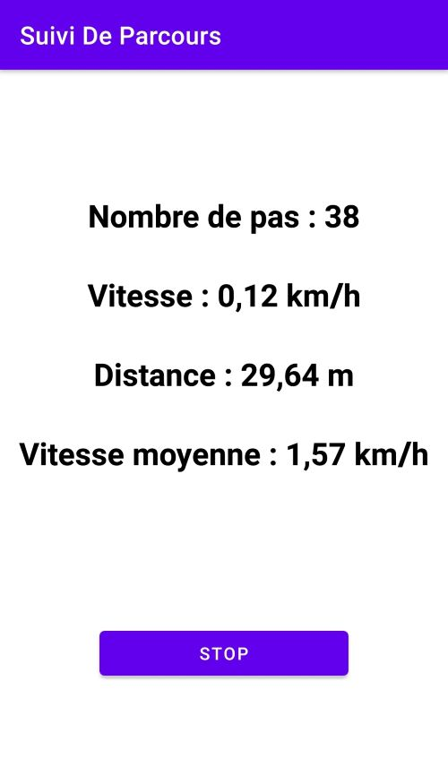
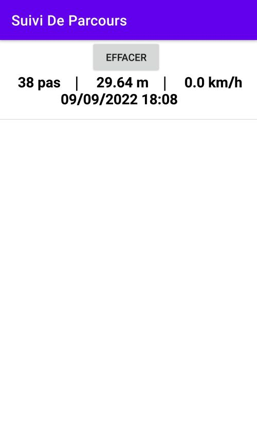
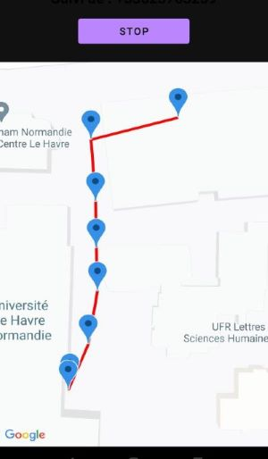

# Android - Suivi de parcours

Conception d'une application Android qui regroupe un ensemble d’informations sur un parcours effectué par une personne et qui permette également de tenir au courant, en quasi temps réel, une autre personne de son parcours.

## Captures d'écran

Menu principal :

Marcheur :

Historique :

Suiveur :

